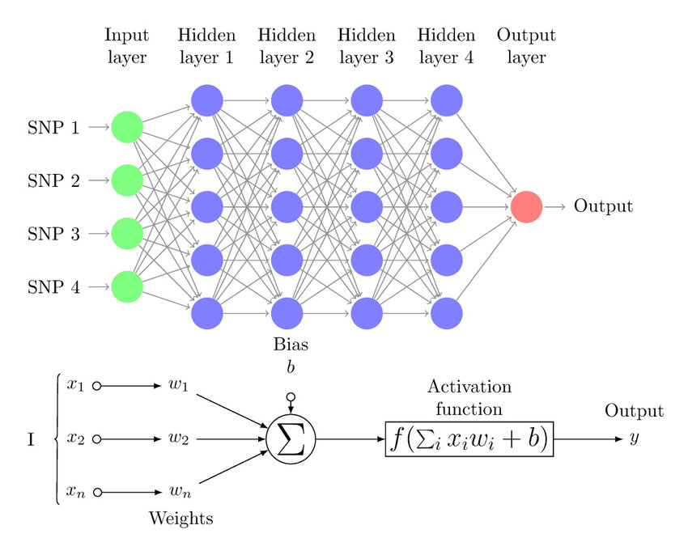
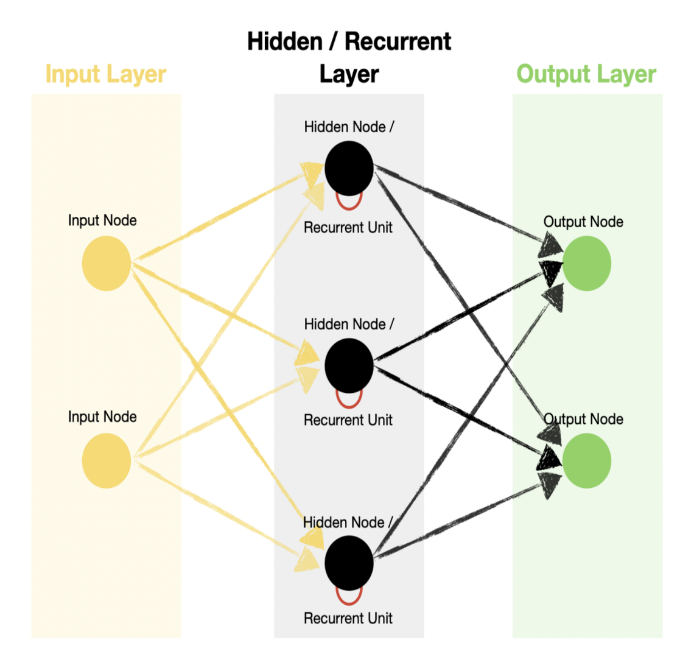
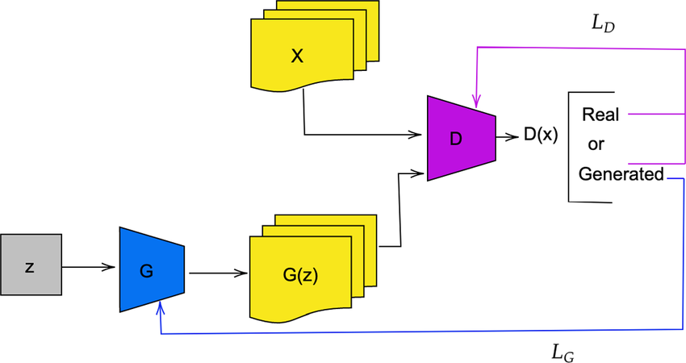
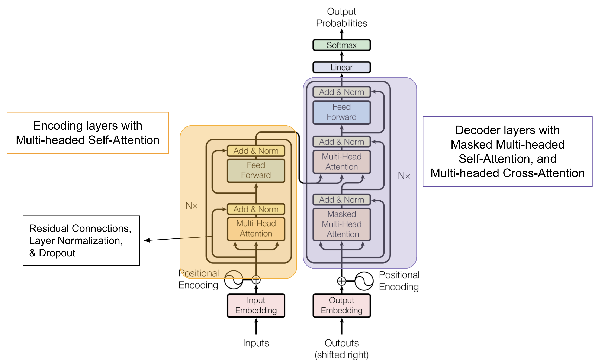
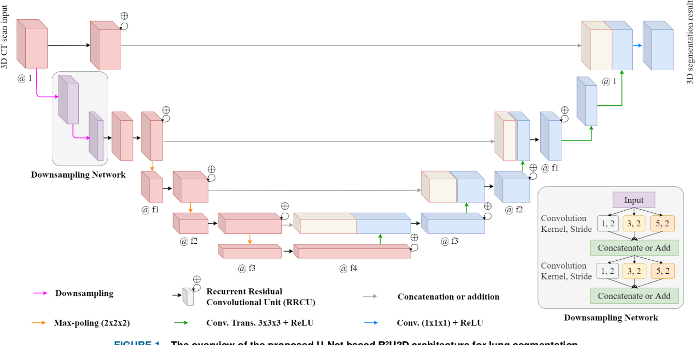
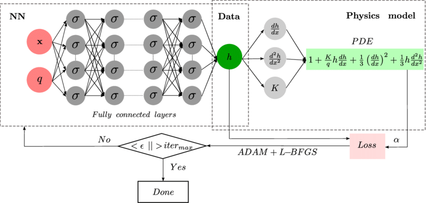

# MLP (Multi-Layer Perceptron)

The Multi-Layer Perceptron (MLP) is one of the simplest and most commonly used types of neural network architecture, consisting of fully connected layers. Each layer in the network is connected to every neuron in the previous and subsequent layers, allowing the model to learn complex relationships in the data.

MLPs are particularly effective for regression and classification tasks, especially when working with structured/tabular data (such as spreadsheets or databases). They can be applied to a wide variety of problems, from predicting numerical values to categorizing data into classes.

One of the key features of MLPs is their ability to approximate any continuous function, making them versatile and powerful tools for a range of machine learning tasks.

 

# CNN (Convolutional Neural Network)

Finding the optimal parameters in a Multi-Layer Perceptron (MLP) can be a challenging task. In contrast, Convolutional Neural Networks (CNNs) offer a powerful approach by automatically learning and filtering the most relevant features from data for classification and regression tasks.

CNNs are particularly effective for working with spatial data, such as images, because they can capture hierarchical patterns and spatial relationships in the data. This makes them highly suitable for tasks like image classification, object detection, and other computer vision applications, where understanding the structure and context of visual information is essential.

# RNN (Recurrent Neural Network)

Sequential tasks often require a model to remember previous inputs in order to capture temporal dependencies, such as seasonal patterns or the logical structure in text. Recurrent Neural Networks (RNNs) are designed to handle such tasks by maintaining memory of past information and using it to make predictions based on sequences.

Long Short-Term Memory (LSTM) networks are a type of RNN that can effectively capture long-term dependencies in data by mitigating the vanishing gradient problem. Similarly, Gated Recurrent Units (GRUs), with their simplified architecture, can also capture these long-term dependencies while being computationally more efficient than LSTMs.

# GANs (Generative Adversarial Network)

Generative Adversarial Networks (GANs) are a class of neural networks designed to generate new data—such as images, videos, and audio—that closely resemble real-world data. GANs consist of two main components: the **generator** and the **discriminator**. The **generator** creates synthetic data, while the **discriminator** evaluates whether the data is real (from the training set) or fake (generated by the model). The two models are trained in tandem through an adversarial process, where the generator attempts to produce data that is increasingly indistinguishable from real data, while the discriminator works to become better at distinguishing between the two.

As training progresses, the generator improves its ability to create more realistic data, and the discriminator becomes better at identifying subtle differences. The process continues until the discriminator cannot reliably differentiate between real and generated data, at which point the generator is considered to have learned to produce data that is highly realistic.

GANs have shown remarkable potential in various applications, such as image synthesis, video generation, audio creation, and even data augmentation. Their ability to create high-quality, realistic content has made them one of the most powerful tools in deep learning for creative and generative tasks.

# Transformers

Transformers are a powerful neural network architecture designed to efficiently process sequential data, especially in the context of large-scale data, by allowing parallelization. This approach significantly enhances performance for tasks involving Big Data. The core innovation of transformers lies in the **self-attention mechanism**, which enables the model to assign different weights to different parts of the sequence, allowing it to focus on the most relevant information.

The architecture consists of two main components: the **encoder** and the **decoder**. The **encoder** is responsible for processing the input data and creating a representation or context of it, while the **decoder** generates new content based on that representation.

Transformers have become the dominant model for Natural Language Processing (NLP) tasks because they excel at capturing complex, long-term dependencies in data, outperforming older models like Recurrent Neural Networks (RNNs) in many areas. Their ability to efficiently handle relationships across long sequences makes them especially effective for tasks such as machine translation, text generation, and more.

# Autoencoders

Autoencoders are neural networks designed for unsupervised learning tasks, primarily used for dimensionality reduction, noise removal, anomaly detection, and data generation. The architecture consists of two main components: the **encoder** and the **decoder**.

- The **encoder** compresses the input data into a lower-dimensional representation, known as the **latent space** or **bottleneck**. This latent layer captures the most essential features of the input while reducing its dimensionality.
- The **decoder** then reconstructs the original data (or generates new data, depending on the task) from this compressed representation.

Autoencoders are widely used in applications where it’s important to reduce the complexity of data without losing critical information. They are particularly useful in noise reduction by learning to reconstruct clean data from noisy inputs, detecting anomalies by identifying deviations from normal patterns, and generating new data by learning the underlying distribution of a given dataset.

Their ability to learn efficient representations of data makes them valuable for tasks like data compression, denoising, and even generating synthetic data for various domains.

# U-Nets and Difusion Network

U-Nets and Diffusion models are powerful architectures primarily developed for image segmentation tasks. U-Net, in particular, is designed with a distinctive U-shaped architecture, consisting of an **encoder** and a **decoder** component, which work together to capture both global context and local details in the image.

- The **encoder** (also known as the contracting path) typically uses convolutional layers and **max-pooling operations**, similar to those found in Convolutional Neural Networks (CNNs). This part of the network progressively reduces the spatial dimensions of the input image while extracting important features.
- The **decoder** (or expansive path) works to upsample and reconstruct the image to its original size, using transposed convolutions to enable precise localization of features. This helps retain detailed spatial information and is especially useful for segmenting objects in the image.

One of the key innovations of U-Net is the use of **skip connections** between corresponding layers of the encoder and decoder, which allows the model to combine high-level features with fine-grained details, improving segmentation accuracy.

U-Nets are highly efficient for image segmentation tasks, such as identifying and classifying different regions or objects within an image. This architecture is widely used in medical imaging, satellite image analysis, and other fields where precise pixel-level classification is required.

In addition, Diffusion models, while more complex, are often used for generative tasks, including image generation and denoising. They gradually transform a noisy image into a clean one by applying a series of steps, which can be effectively combined with U-Net architectures for improved results in tasks like image denoising, super-resolution, and segmentation.

Together, these models provide a robust solution for tasks that require both understanding the overall structure of an image and accurately pinpointing smaller, detailed regions within it.

# Physics-Informed Neural Network (PINNs)

Physics-Informed Neural Networks (PINNs) are a valuable approach when there is insufficient data to train a model, as they leverage underlying **physical laws** to guide the learning process. Unlike traditional neural networks that rely solely on data, PINNs incorporate physical knowledge—such as differential equations, boundary conditions, and conservation laws—directly into the model's training process. 

By doing so, PINNs can effectively solve problems in fields like fluid dynamics, material science, and engineering, where data might be limited or difficult to obtain. The model is trained to not only fit available data but also to satisfy the governing physical equations, making it a powerful tool for solving complex real-world problems where traditional data-driven methods might fall short.

This approach enables more accurate predictions, even with sparse or noisy data, by ensuring that the neural network's output respects the fundamental principles of physics.

