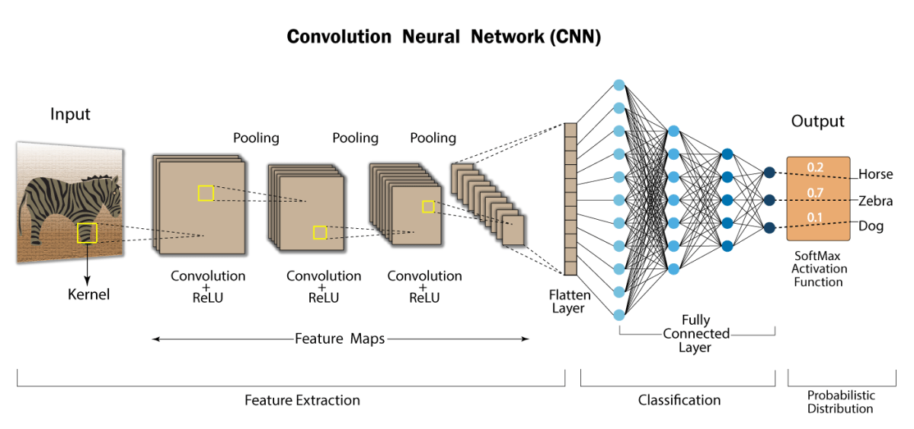

# MLP (Multi-Layer Perceptron)

The Multi-Layer Perceptron (MLP) is one of the simplest and most commonly used types of neural network architecture, consisting of fully connected layers. Each layer in the network is connected to every neuron in the previous and subsequent layers, allowing the model to learn complex relationships in the data.

MLPs are particularly effective for regression and classification tasks, especially when working with structured/tabular data (such as spreadsheets or databases). They can be applied to a wide variety of problems, from predicting numerical values to categorizing data into classes.

One of the key features of MLPs is their ability to approximate any continuous function, making them versatile and powerful tools for a range of machine learning tasks.

 

# CNN (Convolutional Neural Network)

Finding the optimal parameters in a Multi-Layer Perceptron (MLP) can be a challenging task. In contrast, Convolutional Neural Networks (CNNs) offer a powerful approach by automatically learning and filtering the most relevant features from data for classification and regression tasks.

CNNs are particularly effective for working with spatial data, such as images, because they can capture hierarchical patterns and spatial relationships in the data. This makes them highly suitable for tasks like image classification, object detection, and other computer vision applications, where understanding the structure and context of visual information is essential.

# RNN (Recurrent Neural Network)

Sequential tasks often require a model to remember previous inputs in order to capture temporal dependencies, such as seasonal patterns or the logical structure in text. Recurrent Neural Networks (RNNs) are designed to handle such tasks by maintaining memory of past information and using it to make predictions based on sequences.

Long Short-Term Memory (LSTM) networks are a type of RNN that can effectively capture long-term dependencies in data by mitigating the vanishing gradient problem. Similarly, Gated Recurrent Units (GRUs), with their simplified architecture, can also capture these long-term dependencies while being computationally more efficient than LSTMs.

